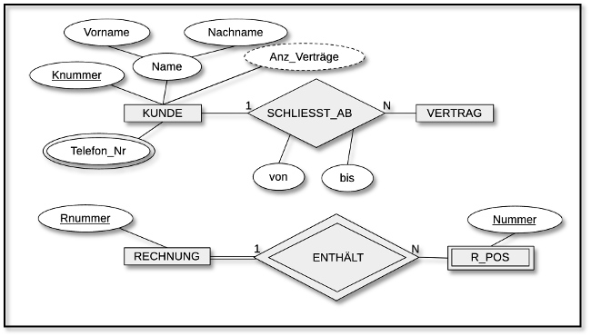
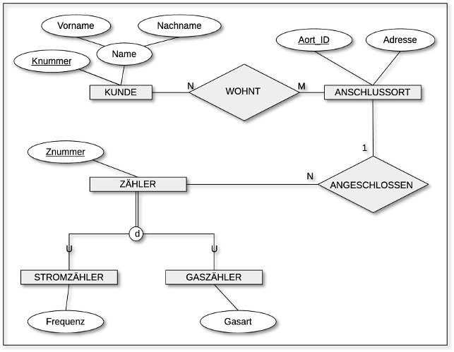

# Kontext

## ER-Modell

## EER-Modell

# Aufgabe 1
Geben Sie ein Beispiel für einen ternären Beziehungstyp.

Ergebnisformat: ER-Modell

# Aufgabe 2
Geben Sie ein Instanz-Modell an zum obigen
- ER-Modell
- EER-Modell

Ergebnisformat: z.B. zwei Mengen-Diagramme

# Aufgabe 3
Wandeln Sie in ein UML-Klassendiagramm um
- das obige ER-Modell (zumindest auszugsweise)
- das obige EER-Modell (zumindest auszugsweise)

Ergebnisformat: zwei UML-Klassendiagramme

Was sind die semantischen Unterscheiede zwischen ER-Modellen und UML-Klassendiagrammen?

Ergebnisformat: Auflistung mit 2 - 3 Unterschieden (Stichpunkte genügen)

# Aufgabe 4

Modellieren Sie den Sachverhalt “Buch-Exemplare in einer Bibliothek mit Autor, Titel, ISBN und eindeutiger Kennzeichnung für Ausleihe/Rückgabe”
- konzeptionell
- logisch (Normalformen!)

Ergebnisformat:
- ER-Modell
- logisches Modell
